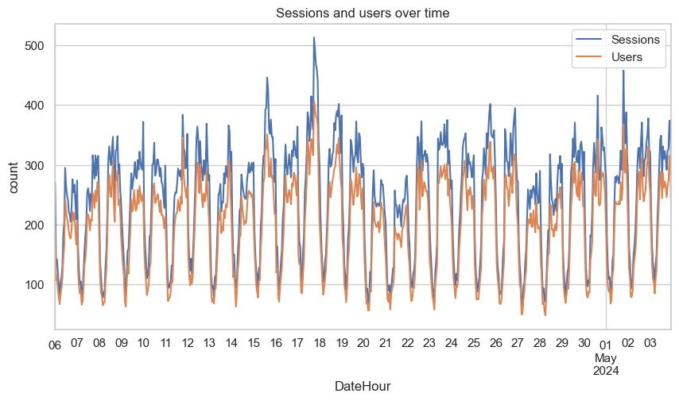
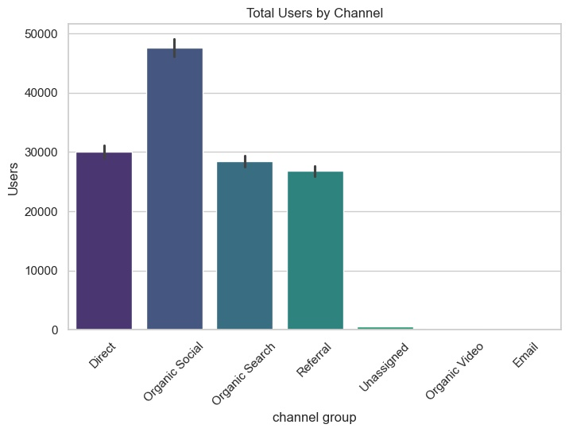
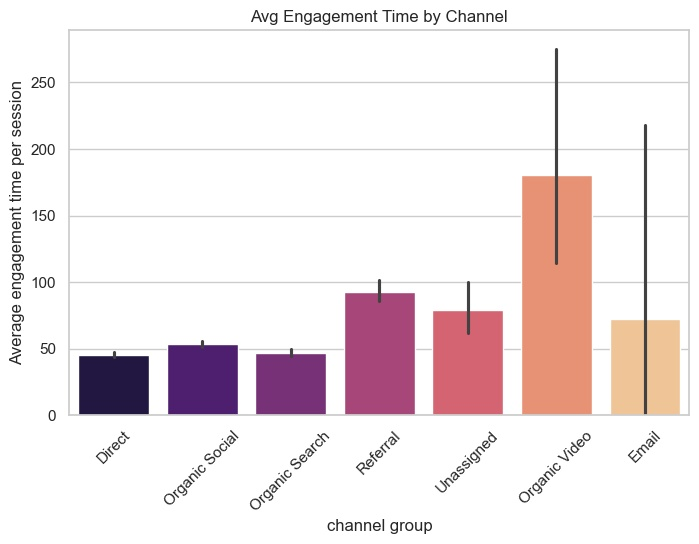
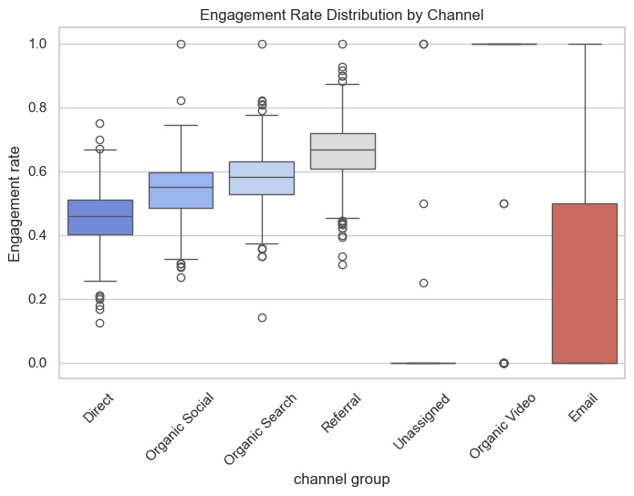
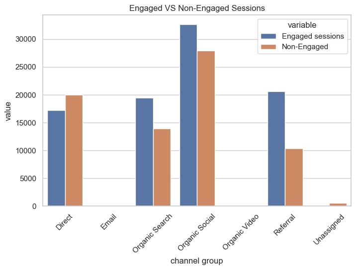
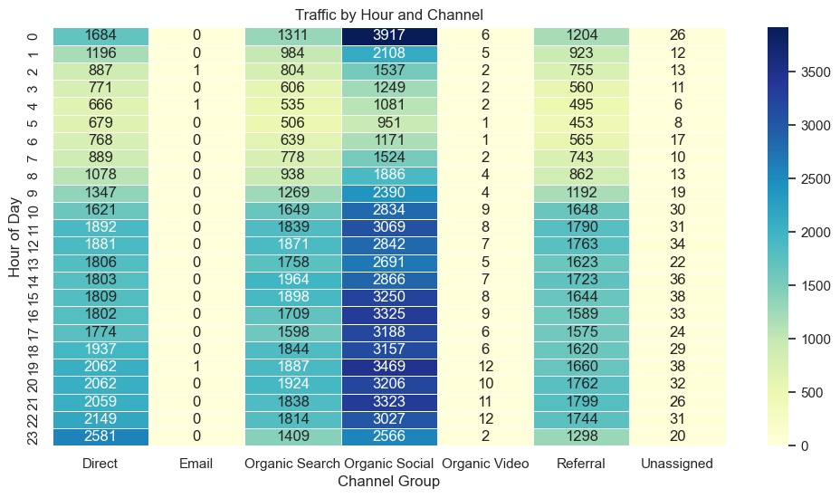

# 📊 Website Performance & Engagement Analysis Using Python

  

## 🚀 Project Overview
This project analyzes **website performance and user engagement** using Python 📈.  
The goal is to understand **traffic patterns, user behavior, channel performance, and time-based trends** through data cleaning, feature engineering, exploratory data analysis, and rich visualizations.

This is an **applied exploratory data analysis (EDA)** project with real-world, business-oriented insights 💡.

---

## 🎯 Project Objectives
- 📊 Analyze website traffic across different channel groups  
- 👥 Understand user behavior using **sessions** and **engagement rate**  
- ✅ Compare **engaged vs non-engaged sessions**  
- ⏰ Perform **hour-wise (time-based) traffic analysis**  
- 📈 Visualize trends using Python libraries  
- 💼 Generate actionable business insights  

---

## 📂 Dataset & Code

- 📁 **Dataset Used**:  
  👉 [Website Analytics Dataset (CSV)](https://github.com/himanshujoshitech/Website-Performance-Engagement-Analysis-Using-Python-/blob/main/Raw_Data.csv)

- 🐍 **Python / Jupyter Notebook**:  
  👉 [Website Performance & Engagement Analysis Code](https://github.com/himanshujoshitech/Website-Performance-Engagement-Analysis-Using-Python-/blob/main/Website%20Performance%20%26%20Engagement%20Analysis%20Using%20Python%20Code.ipynb)

- 👤 **Author**:  
  👉 [Himanshu Joshi on LinkedIn](https://www.linkedin.com/in/himanshujoshitech/)

---

## 🛠️ Tools & Technologies
- 🐍 Python  
- 📦 Pandas  
- 🔢 NumPy  
- 📊 Matplotlib  
- 🎨 Seaborn  
- 📓 Jupyter Notebook  

---

## 🧹 Data Cleaning & Feature Engineering
Before analysis, the dataset was cleaned and prepared to ensure accuracy and consistency:

- 🧼 Standardized column headers  
- 🗑️ Removed redundant header rows  
- 🕒 Converted `DateHour` to datetime format  
- 🔢 Converted numeric columns safely using type coercion  
- ⚠️ Handled missing and invalid values  
- ⏰ Extracted `Hour` feature for time-based analysis  
- ➕ Created **Non-Engaged Sessions** feature  

---

## 🧠 Exploratory Data Analysis (EDA)
EDA was performed to explore:
- Distribution of sessions and engagement  
- Channel-wise performance differences  
- Time-based traffic behavior  
- Variability and outliers in engagement metrics  

Functions such as `df.info()` and `df.describe()` were used to understand data structure and statistics.

---

## 📈 Visual Analysis & Insights

### 🔹 Sessions and Users Over Time

📌 *This line chart shows how website traffic (sessions and users) changes over time, helping identify overall trends and peak activity periods.*

---

### 🔹 Total Users by Channel

📌 *This bar chart highlights which traffic channels bring the highest number of users, helping evaluate channel reach and traffic contribution.*

---

### 🔹 Average Engagement Time by Channel

📌 *This visualization compares how long users stay engaged across different channels, helping identify channels that attract higher-quality users.*

---

### 🔹 Engagement Rate Distribution by Channel

📌 *The box plot shows the distribution and variability of engagement rate across channels, including outliers and consistency in user engagement.*

---

### 🔹 Engaged vs Non-Engaged Sessions

📌 *This comparison highlights the proportion of meaningful (engaged) sessions versus non-engaged sessions for each channel.*

---

### 🔹 Traffic by Hour and Channel (Heatmap)

📌 *The heatmap visualizes session intensity by hour and channel, revealing peak traffic periods and optimal times for engagement.*

---

## 📌 Key Findings
- 🚦 High traffic does not always result in high engagement  
- 🎯 Some channels generate fewer users but higher engagement quality  
- ⏰ User activity and engagement vary significantly by hour  
- ⚠️ A noticeable portion of sessions are non-engaged  
- 📊 Time-based and channel-based analysis reveals optimization opportunities  

---

## 💡 Business Insights & Recommendations
- 📢 Focus marketing efforts on **high-engagement channels**, not just high traffic  
- 🛠️ Improve landing pages for channels with high non-engaged sessions  
- ⏱️ Schedule campaigns during **peak engagement hours**  
- 😊 Use engagement metrics to enhance user experience and retention  

---

## ✅ Conclusion
This project demonstrates how Python can be effectively used for **real-world website analytics** 🧠.  
By combining data cleaning, feature engineering, exploratory analysis, and visualization, meaningful insights were extracted from raw website data.

This project is suitable for:
- 🎓 Academic evaluation  
- 📁 Data analytics portfolio  
- 💼 Entry-level Data Analyst interviews  

---

## 🙌 About the Author
**Himanshu Joshi**  
📍 India  
🔗 [LinkedIn Profile](https://www.linkedin.com/in/himanshujoshitech/)  

---

⭐ If you found this project helpful, feel free to **star the repository** and connect on LinkedIn!
